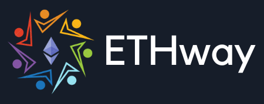

# ETHway

The web 2.0 internet is overrun with online frauds and cybercrime activities like identity theft, payment interception, phishing and other notorious activities.

According to estimates, e-commerce losses to online payment fraud were estimated at 41 billion U.S. dollars globally in 2022, up from the previous year.

To prevent such security breaches, the web 3.0, based on the innovative technology of blockchain offers solutions and preventive measures, which includes cryptocurrency. However, a secure payment gateway is crucial for this.

**ETHway** is such a payment gateway that makes the use of decentralised technology to facilitate peer-to-peer transactions between users that are immutatable and stable.

## Tools used for development :

### Frontend -

HTML, Tailwind CSS, ReactJS, Vite

### Backend -

Solidity, Hardhat, Push protocol

#### Use of Smart Contracts :

Drafting Smart Contracts to transfer funds from one account to another, which is linked to Push Protocol (Push Notifications) along with authentication from the connected Metamask wallet of the user.

#### Implementation :

ETHway has been used to transfer GoerliETH and MATIC between different accounts.

#### Use of Push Protocol :

Push Protocol has been used to enable and get Push Notifications when the beneficiary receives the cryptocurrency from the sender.

